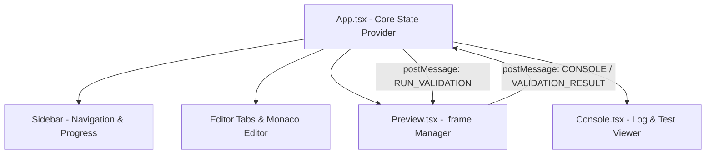

# Product Requirements Document (PRD)
## Project: HTML, CSS & JS Lab (CodeCraft Academy)
**Document Version:** 1.0.0  
**Target Audience:** Development Team, QA Engineers, and TestSprite (AI Testing Engine)

---

## 1. Executive Summary
**HTML, CSS & JS Lab** is a modern, interactive, browser-based learning platform designed to help aspiring frontend developers learn and practice HTML, CSS, and JavaScript. The platform provides a hands-on environment where users can tackle progressive coding challenges, write code in a professional editor, view live visual updates in real time, and verify their solutions using an automated testing and validation framework.

---

## 2. Problem Statement
Learning frontend web development often suffers from high friction:
*   Setting up local development environments (installing Node, IDEs, configuring servers) is intimidating for beginners.
*   Standard online tutorials lack direct feedback loops, making it hard for users to know if their code actually matches the target requirements.
*   Switching between reference manuals, text editors, and browsers dilutes focus.

**HTML, CSS & JS Lab** solves this by providing a zero-setup, all-in-one interactive lab with immediate feedback, progress saving, and automated test execution.

---

## 3. Goals & Objectives
*   **Zero Setup**: Enable users to start writing valid HTML, CSS, and JS in less than 5 seconds from loading the page.
*   **Tight Feedback Loop**: Provide live, debounced visual updates and immediate, descriptive test execution feedback.
*   **Gamified Progression**: Offer a structured curriculum of 40+ challenges that build confidence and track completion status.
*   **Portability & Shareability**: Enable users to save their progress locally and share their exact editor states with others via query parameters.

---

## 4. User Personas
### Persona 1: Sarah, The Aspiring Frontend Developer
*   **Profile**: Beginner student with no prior coding experience.
*   **Needs**: Clear, bite-sized instructions, helpful hints when stuck, and immediate confirmation that her code is correct.
*   **Behavior**: Relies heavily on the instructions column, preview panel, and console log output to debug issues.

### Persona 2: Alex, The Intermediate Learner
*   **Profile**: Has basic knowledge of HTML/CSS but wants to practice interactive JavaScript.
*   **Needs**: Quick navigation between challenges, keyboard shortcuts (like Ctrl+S for formatting), and the ability to test complex DOM manipulations.
*   **Behavior**: Uses tabbed editor views, resets code if an experiment fails, and shares solutions with peers.

---

## 5. Scope & Functional Requirements

### 5.1 System Scope
#### In-Scope (MVP Features)
1.  **Sidebar Curriculum Navigation**: List of 40+ challenges categorized by difficulty and type, with a visual progress bar.
2.  **Challenge Details Panel**: Rich text description, structured instructions, and optional expandable hints.
3.  **Tabbed Code Editor**: Monaco Editor wrapper supporting HTML, CSS, and JavaScript files with Prettier formatting.
4.  **Auto-Save Engine**: Debounced background persistence of written code for every challenge.
5.  **Live Interactive Preview**: An isolated iframe rendering HTML, CSS, and JavaScript with console output redirection.
6.  **Automated Validation Engine**: Custom JavaScript assertions run inside the preview DOM to verify challenge goals.
7.  **Progress Tracking**: Local storage persistence of completed challenge IDs and the last active challenge.
8.  **Solution Sharing**: Base64 encoding of editor states into URL query parameters for easy sharing.

#### Out-of-Scope (Future Phases)
1.  User accounts and database-backed cloud synchronization (Google/GitHub OAuth).
2.  Multi-file explorer (beyond index.html, styles.css, script.js).
3.  A community forum or public gallery for shared solutions.

---

## 6. Detailed Feature Requirements & Acceptance Criteria
*These criteria are structured to facilitate automated end-to-end testing with TestSprite.*

### 6.1 Sidebar & Curriculum Navigation
*   **Description**: A vertical sidebar on the left displays the logo, progress summary, and a scrollable list of challenges.
*   **Acceptance Criteria**:
    *   **FR-1.1**: The curriculum must display all challenges defined in the system.
    *   **FR-1.2**: Each challenge item in the sidebar must display its status (Completed indicated by a green checkmark circle; Uncompleted indicated by a gray circle).
    *   **FR-1.3**: Clicking a challenge in the sidebar must instantly update the active challenge view, loading the correct title, description, initial/saved code, and resetting the Console panel.
    *   **FR-1.4**: A progress bar must display the overall completion percentage: `(completedChallenges / totalChallenges) * 100`.
    *   **FR-1.5**: The progress bar must dynamically update whenever a challenge is marked complete.

### 6.2 Challenge Description & Instructions
*   **Description**: Displays the selected challenge's title, description text, general instructions, and a hint toggler.
*   **Acceptance Criteria**:
    *   **FR-2.1**: The panel must render the active challenge's title and description.
    *   **FR-2.2**: If the challenge contains a `hint` field, a "Need a Hint?" button must be visible.
    *   **FR-2.3**: Clicking "Need a Hint?" must reveal the hint box. Clicking it again must hide it.
    *   **FR-2.4**: If the challenge does not contain a `hint` field, the "Need a Hint?" button must not be rendered.

### 6.3 Code Editor (Monaco Integration)
*   **Description**: A three-tab editor (index.html, styles.css, script.js) loaded with the Monaco Editor.
*   **Acceptance Criteria**:
    *   **FR-3.1**: The tabs (index.html, styles.css, script.js) must allow switching editor focus. Clicking a tab must bring its code view to the foreground.
    *   **FR-3.2**: When a challenge is loaded for the first time, the editors must load the challenge's `initialCode`. If the user has previously typed code for this challenge, it must load the cached code instead.
    *   **FR-3.3**: The editor must auto-save user inputs to local storage. An auto-save indicator in the header must show `Saving...` during text entry and update to `Saved` 1 second after typing stops (debounced).
    *   **FR-3.4**: Clicking the Format button (Wand2 icon) or pressing `Ctrl+S` / `Cmd+S` inside the editor must trigger Prettier formatting on the active tab's content.
    *   **FR-3.5**: Clicking the Reset button (RotateCcw icon) must trigger a native browser confirmation dialog. If confirmed, the editor contents must be replaced with the challenge's original `initialCode`, and local storage cache must update.
    *   **FR-3.6**: Clicking the Share button (Share2 icon) must generate a base64 encoded string containing the HTML, CSS, and JS states, copy it to the clipboard as a URL param, and display a "Link Copied!" feedback message.

### 6.4 Live Preview Panel
*   **Description**: A white rendering canvas displaying a live execution of the written code inside a sandboxed iframe.
*   **Acceptance Criteria**:
    *   **FR-4.1**: The preview window must render the composite HTML, CSS, and JS codes.
    *   **FR-4.2**: The iframe must update automatically in the background using a 500ms debounce when the user edits code.
    *   **FR-4.3**: Clicking the manual "Refresh" button must force-reload the iframe with the current editor contents.
    *   **FR-4.4**: The iframe must be sandboxed with `allow-scripts allow-modals allow-same-origin` to ensure security while permitting scripting.

### 6.5 Console & Validation Output
*   **Description**: A console panel at the bottom right that intercepts iframe outputs and lists test suite results.
*   **Acceptance Criteria**:
    *   **FR-5.1**: All standard `console.log` and `console.error` calls executed within the preview iframe must be proxied and displayed in chronological order in the Console panel.
    *   **FR-5.2**: Script exceptions (runtime errors) occurring inside the iframe must be captured and displayed as error logs with their line numbers.
    *   **FR-5.3**: Clicking the "Clear" button in the Console header must wipe out all logged outputs.
    *   **FR-5.4**: Clicking the "Run Tests" button must compile the challenge's `validationCode` and execute it against the iframe's DOM.
    *   **FR-5.5**: If the validation assertions succeed:
        *   A green validation status card must appear in the Console saying "All Tests Passed".
        *   The challenge must be marked as completed in state and local storage.
        *   A green checkmark must appear next to the challenge in the sidebar.
    *   **FR-5.6**: If the validation assertions fail:
        *   A red validation card must appear in the Console saying "Tests Failed" along with the specific failure message.
        *   The challenge must *not* be marked as completed.

---

## 7. Technical Considerations & System Architecture

### 7.1 Tech Stack
*   **Frontend Library**: React 19 (TypeScript)
*   **Build Utility**: Vite 6.2
*   **Text Editor**: Monaco Editor (via `@monaco-editor/react`) loaded asynchronously from jsDelivr CDN (`monaco-editor@0.45.0`)
*   **Styling**: Tailwind CSS
*   **Iconography**: Lucide React
*   **Code Formatting**: Prettier Standalone (in-browser parser modules for HTML, PostCSS, Babel, Estree)

### 7.2 Core Architecture & Component Diagram
The system operates entirely client-side. The primary component tree is structured as follows:



### 7.3 Message Passing API (Parent-Iframe Communication)
Communication between the main application shell and the preview iframe occurs via HTML5 `window.postMessage`.

#### 1. Execute Validation (Parent to Iframe)
*   **Direction**: `App.tsx` -> `Preview.tsx` (IFrame)
*   **Schema**:
    ```json
    {
      "type": "RUN_VALIDATION",
      "code": "const h1 = document.querySelector('h1'); if (!h1) return { success: false, message: 'No h1 tag found.' }; return { success: true };"
    }
    ```

#### 2. Console Redirection (Iframe to Parent)
*   **Direction**: `Preview.tsx` (IFrame) -> `App.tsx`
*   **Schema**:
    ```json
    {
      "type": "CONSOLE",
      "level": "log" | "error",
      "args": ["Hello World", {"item": 1}]
    }
    ```

#### 3. Return Validation Result (Iframe to Parent)
*   **Direction**: `Preview.tsx` (IFrame) -> `App.tsx`
*   **Schema (Success/Fail)**:
    ```json
    {
      "type": "VALIDATION_RESULT",
      "result": {
        "success": true,
        "message": "Challenge complete!"
      }
    }
    ```
*   **Schema (Runtime Exception inside Validation Script)**:
    ```json
    {
      "type": "VALIDATION_RESULT",
      "error": "TypeError: Cannot read properties of null (reading 'textContent')"
    }
    ```

### 7.4 LocalStorage Storage Schemas

#### 1. Challenge Progress Schema
*   **Storage Key**: `codecraft_progress`
*   **Value Format**:
    ```json
    {
      "completedChallengeIds": ["1-hello-world", "html-paragraphs"],
      "lastActiveChallengeId": "html-anchor"
    }
    ```

#### 2. User Code Cache Schema
*   **Storage Key**: `codecraft_code_cache`
    *   *Note: Code is cached on a per-challenge basis to preserve user input across tabs and selections.*
*   **Value Format**:
    ```json
    {
      "1-hello-world": {
        "html": "<h1>Hello World</h1>",
        "css": "h1 { color: red; }",
        "js": "console.log('Hello!');"
      },
      "html-paragraphs": {
        "html": "<h1>My Article</h1>\n<p>This is a paragraph.</p>",
        "css": "",
        "js": ""
      }
    }
    ```

### 7.5 Solution Share Link Serialization
When sharing a solution, the current active challenge ID and the encoded code are serialized into a single URL.
*   **Encoding Flow**: 
    1. `JSON.stringify(code_object)` -> `{"html":"...", "css":"...", "js":"..."}`
    2. `encodeURIComponent` & `unescape` (safeguards Unicode/Emoji values)
    3. `btoa` (Base64 encoding)
*   **URL Structure**:
    `http://localhost:5173/?id={challenge_id}&code={base64_string}`
*   **Decoding Flow**:
    `atob` -> `escape` & `decodeURIComponent` -> `JSON.parse`

---

## 8. Test Cases & Verification Guidelines for TestSprite

To verify the platform's features, the AI testing agent (TestSprite) should execute the following test scenarios:

### Test Suite 1: Navigation & Loading
*   **Scenario 1.1: Default Load State**
    *   *Step*: Open the application home page without any parameters.
    *   *Expectation*: The first challenge ("1. HTML: The Basics") should be loaded by default. The HTML tab in the editor should display the default placeholder text `<!-- Write your code here -->`. The progress bar should show `0%`.
*   **Scenario 1.2: Challenge Navigation**
    *   *Step*: Click on "2. HTML: Paragraphs" in the sidebar.
    *   *Expectation*: The header changes to "2. HTML: Paragraphs". Description updates to target paragraph instructions. The editor contains the initial template text `<h1>My Article</h1>...`. The Console panel is cleared.

### Test Suite 2: Code Persistence & Resets
*   **Scenario 2.1: Auto-Save Verification**
    *   *Step*: Navigate to a challenge, select the HTML tab, and type `<h1>Test Title</h1>`. Wait for 1.5 seconds.
    *   *Expectation*: The save status indicator transition from `Saving...` to `Saved`. Reload the page. The editor must retain the typed text `<h1>Test Title</h1>`.
*   **Scenario 2.2: Code Resetting**
    *   *Step*: Click the Reset button. Confirm the browser dialog.
    *   *Expectation*: The editor content reverts to the default starter template code. Local storage key `codecraft_code_cache` updates.

### Test Suite 3: Test Execution & Progress
*   **Scenario 3.1: Failed Test Execution**
    *   *Step*: Navigate to the "1. HTML: The Basics" challenge. Type `<h1>Goodbye World</h1>` inside the HTML tab. Click "Run Tests".
    *   *Expectation*: A validation card appears in the Console showing "Tests Failed" and the message "The <h1> text should be 'Hello World'." The sidebar status remains uncompleted.
*   **Scenario 3.2: Successful Test Execution**
    *   *Step*: Correct the HTML code to `<h1>Hello World</h1>`. Click "Run Tests".
    *   *Expectation*: The Console outputs "All Tests Passed". The sidebar item receives a green check icon. The progress indicator increases. Reload the page: the progress must remain persisted.

### Test Suite 4: Code Formatting & Sharing
*   **Scenario 4.1: Code Formatting**
    *   *Step*: Enter poorly indented HTML (e.g. `<div>   <h1>test</h1>   </div>` on a single line). Press `Ctrl+S`.
    *   *Expectation*: Prettier formats the code block to be cleanly aligned and structured over multiple lines.
*   **Scenario 4.2: Solution Import via Share URL**
    *   *Step*: Enter some custom HTML/CSS and click the Share icon. Note the generated link. Clear local storage. Navigate to the copied link in a new browser context.
    *   *Expectation*: The page loads the target challenge, and the editor automatically populates with the exact custom HTML/CSS code entered before sharing.

---

## 9. Risks & Mitigations
1.  **Risk: Sandbox Escape / Iframe Vulnerability**
    *   *Mitigation*: The preview iframe must enforce strict HTML5 sandbox attributes (`allow-scripts allow-modals allow-same-origin`). No root page window credentials or local storage spaces should be exposed to scripts running within the preview.
2.  **Risk: Heavy Monaco Editor Bundle Size**
    *   *Mitigation*: Monaco Editor is loaded dynamically from CDN after the page mount rather than being bundled, keeping the initial JS bundle lightweight.
3.  **Risk: Validation Script Crashing App**
    *   *Mitigation*: All validation evaluations run inside a try-catch block inside the iframe's validation listener, returning `type: 'VALIDATION_RESULT'` with an error property to prevent parent crash.
